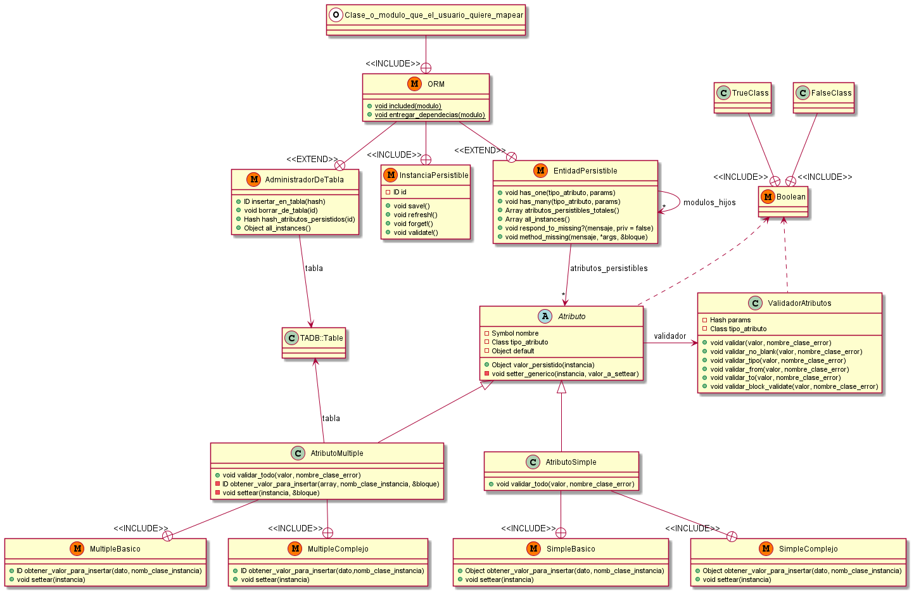

# Trabajo Práctico N°01: ORM

## Integrantes:
* Anzorandía, Matías
* Deheza, Alejandro

## Reglas de Uso: 
- [X] Para que una clase o modulo sea persistible, la misma debe incluir el módulo "ORM" y declarar el "require" correspondiente
- [X] Si una clase o módulo es persistible, todas las subclases o quienes lo incluyan lo serán. Por lo tanto no es necesario que vuelvan a incluir a "ORM"
- [X] Los constructores de de las clases mapeadas no pueden tener parámetros
- [X] La composición de clases no puede ser recursiva
- [X] Eliminar de la base de datos un objeto compuesto no elimina sus componentes
- [X] Nil no rompe en atributos simples o compuestos
- [X] Los atributos simples se validan contra la clase/module del valor

## Diagrama de Clases:

 

